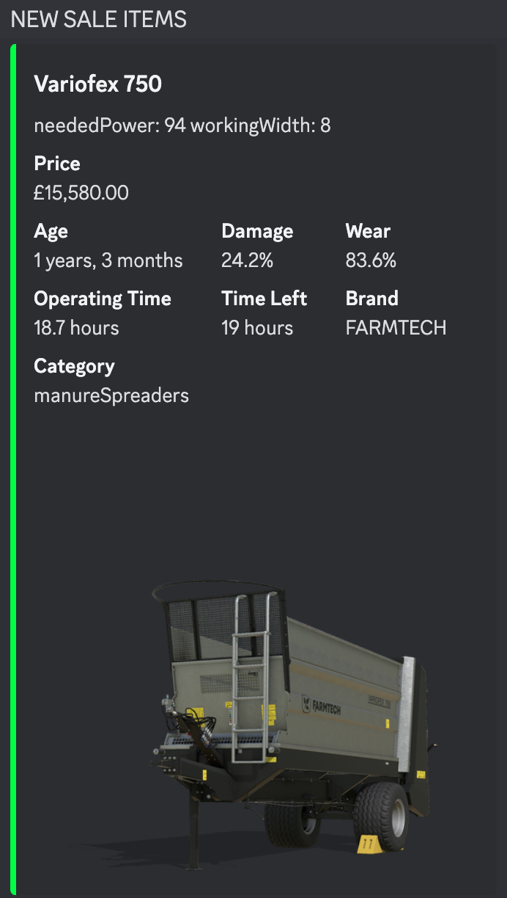
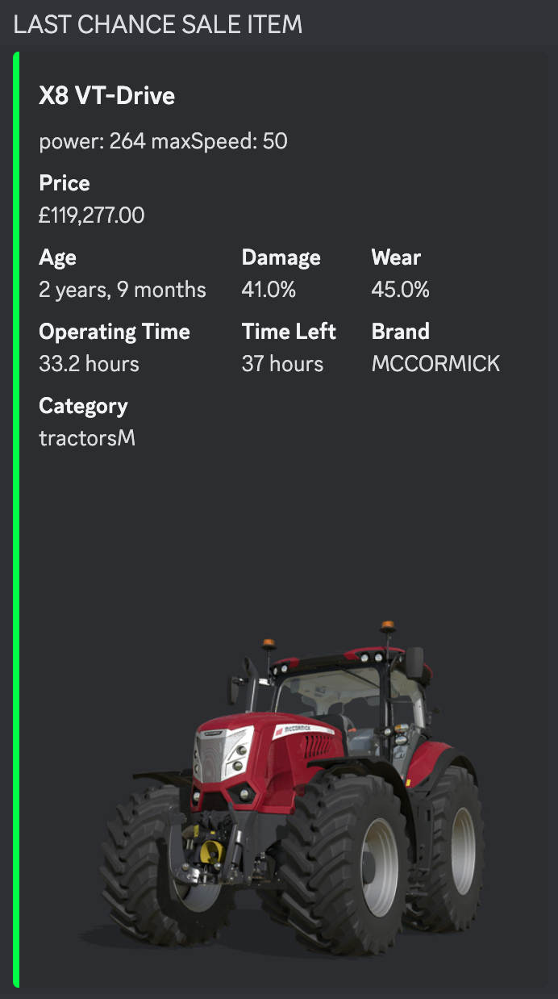

Farming Simulator 2025 Vehicle Sales Discord Bot
------------------------------------------------

This project consists of two main parts:

1.  **Generating an HTML Page with Vehicles on Sale**
2.  **Posting Vehicle Information to Discord**

### Part 1: Generating the HTML Page

The first script reads the sales XML file for vehicles in the *Farming Simulator 2025* game, extracts relevant vehicle details from base game and mod XML files, and generates an HTML page that lists the vehicles available for sale. It also handles DDS to PNG image conversion for displaying vehicle images correctly.

#### How it works:

-   The script parses `sales.xml` for vehicle data, including prices, age, damage, wear, and operating time.
-   It then locates referenced XML files for each vehicle (from the base game or mods) and extracts details such as the vehicle's name, specs, brand, category, and image.
-   DDS images (if present) are converted to PNG format using the `Pillow` library for easier web display.
-   The vehicle information is formatted into HTML and saved as `vehicles_on_sale.html`.

**Requirements:**

-   Python 3.x
-   `Pillow` (for image conversion)
-   `xml.etree.ElementTree` (for XML parsing)
-   Logging enabled for error tracking

**How to Run:**

1.  Make sure the paths for the `sales.xml`, `data` folder, and `mods` folder are correctly set in the script.
2.  HTTP/HTTPS access to converted files are required - Update the URL (Line 240) 
   `<a href="https://YOUR-DOMAIN-HERE/{os.path.basename(vehicle_details['image'])}" target="_blank">` 
3.  Ensure that the output folder for images exists.
4.  Execute the script to generate the HTML page.

### Part 2: Posting Vehicle Information to Discord

The second script is a Discord bot that reads the generated HTML page and posts vehicle details to a specified Discord channel. The bot checks for new vehicles or vehicles that qualify for "last chance" notifications (vehicles with 1 hour or less remaining) and sends an embed message with vehicle details.

#### How it works:

-   The bot parses the HTML page generated by the first script.
-   It checks for new vehicles and posts them to Discord, including information such as price, age, damage, specs, operating time, and more.
-   The bot ensures that a vehicle is only posted once per day, and can also send "last chance" reminders for vehicles nearing the end of their sale time.

**Requirements:**

-   Python 3.x
-   `discord.py` library
-   `BeautifulSoup` for HTML parsing
-   A Discord bot token and channel ID

**How to Run:**

1.  Set up a Discord bot and invite it to your server.
2.  Update the `TOKEN` and `CHANNEL_ID` variables in the script with your bot's token and desired Discord channel ID.
3.  HTTP/HTTPS access to converted files are required - Update the URL (Line 29) 
   `BASE_URL = 'https://YOUR-DOMAIN-HERE/'  # URL where images are stored` 
4. Update HTML Location Path (Line 148) 
   `vehicles = parse_html(r'C:\DiscordBots1\Sales\vehicles_on_sale.html')` 
5.  Run the bot script to start the bot.

### Key Features:

-   **HTML Generation**: Lists vehicles currently on sale with their details.
-   **Discord Integration**: Posts vehicle details to a Discord channel with embedded messages.
-   **DDS to PNG Conversion**: Converts vehicle images from DDS to PNG format for easy web display.
-   **Sale Time Tracking**: Posts reminders for vehicles nearing the end of their sale.

### Example Output

1.  **HTML Page**: Displays a list of vehicles available for sale with their details, such as price, age, damage, specs, and an image.

   

   
2.  **Discord Message**: An embed message is sent to Discord with the vehicle's details and image when it qualifies for posting.
   

### Notes:

-   The bot saves a record of posted vehicles to avoid re-posting them unnecessarily.
-   Ensure that the XML files and image paths are correctly set up in the script to match your system's file structure.
-   The HTML output is saved to `vehicles_on_sale.html` in the current working directory.

  
